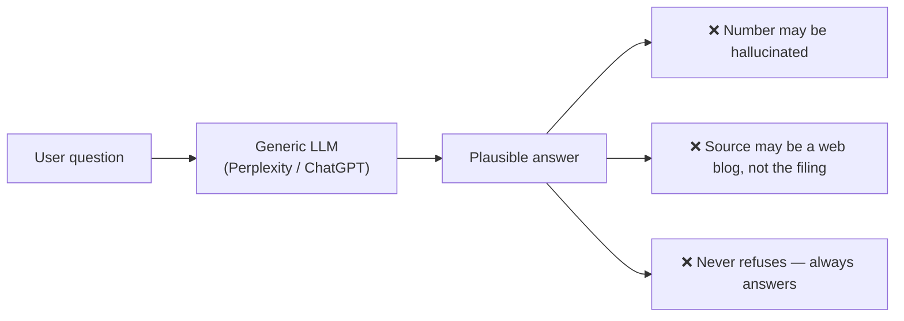
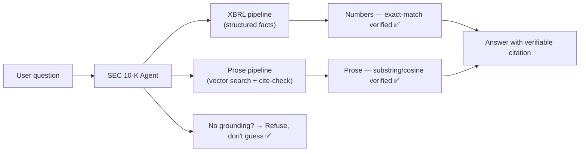
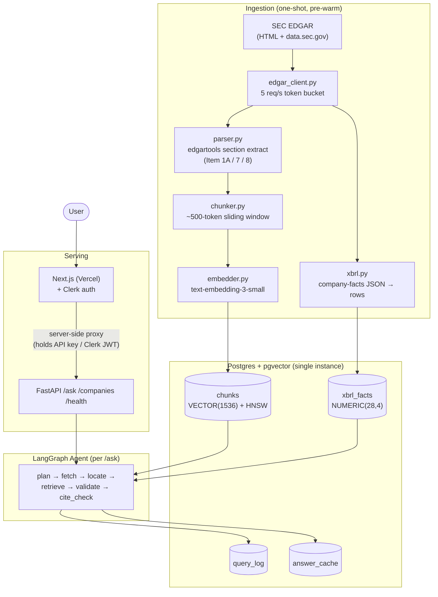
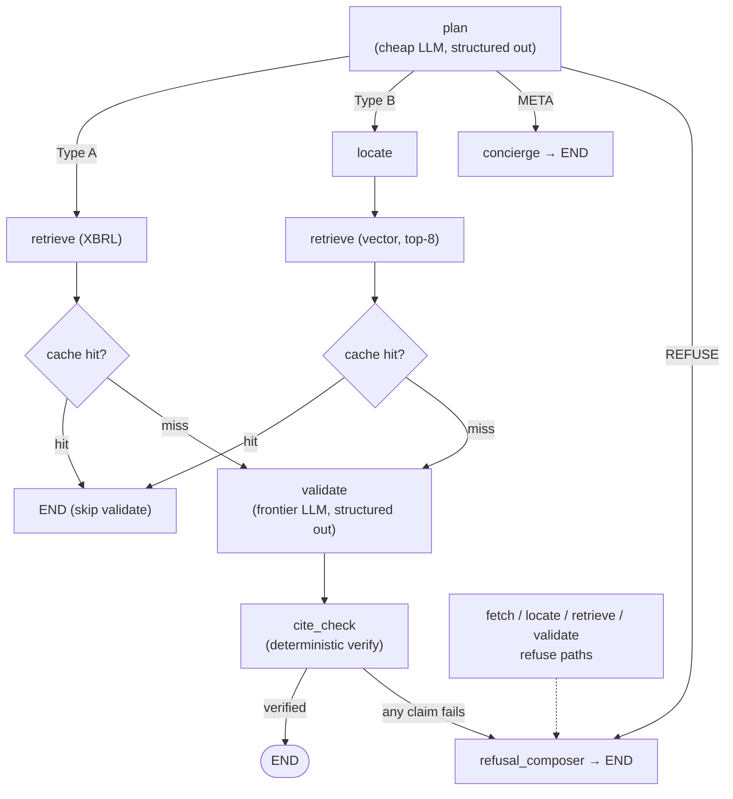
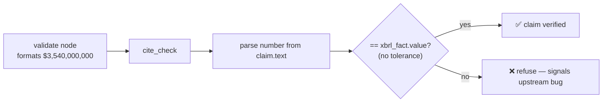
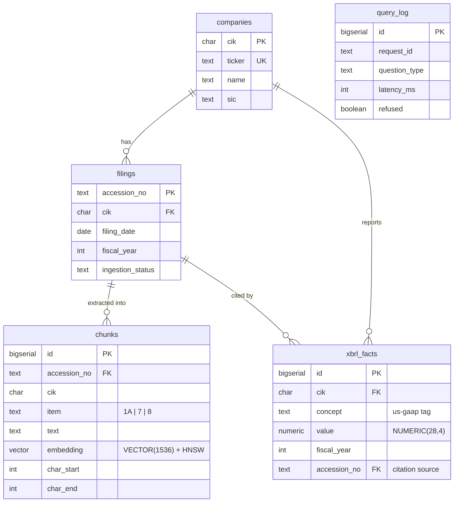
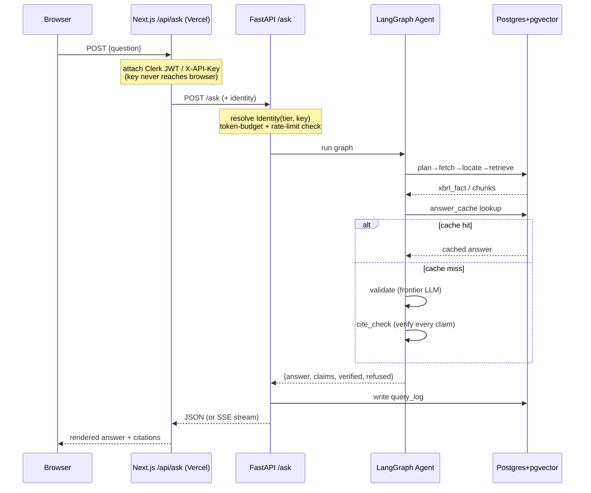

## The trust problem nobody solves

Analysts, investors, and the merely curious all ask the same kind of question about public companies: *"What was Apple's R&D spend in FY2024?"* or *"What cybersecurity risks did Microsoft disclose in their latest 10-K?"*

General-purpose assistants — Perplexity, ChatGPT — will happily answer. And in a financial-diligence context, that eagerness is exactly the problem. They fail in three ways that are all unacceptable when someone is about to make a decision on the answer:

- **Hallucinated numbers.** A confidently-wrong revenue figure looks identical to a correct one. "Apple's R&D was ~$30B" — off by billions, no source.
- **Ungrounded prose.** Risk factors get smoothed out of blended web sources rather than the actual filing. You get a paraphrase of a news article, not Item 1A.
- **No refusal.** The model *always* answers, even when it has no business doing so. Ask about a company it has no data on and it invents a figure.



The core problem is *trust*. In diligence, a wrong-but-confident answer is worse than no answer, because you can't build on a number you can't verify. So I built an agent whose entire design goal is the opposite of "always be helpful": ground every claim in a specific SEC filing, or refuse.

## Making hallucination structural, not aspirational

The interesting design constraint here is that "be more careful" is not a strategy. You can't prompt your way to zero hallucinations — at scale, *unlikely* still means *eventually*. The differentiation had to be **structural**: the architecture should make a hallucinated number *impossible*, not merely improbable.

That comes down to three principles.

**Numbers come from XBRL, never from prose.** Structured financial facts from `data.sec.gov` are the only source allowed to supply a numerical claim. The prose pipeline is *physically incapable* of putting a number into an answer — it never touches the numeric path.

**Every prose claim is verified against its source chunk.** A dedicated `cite_check` step confirms each sentence actually appears in (or is cosine-similar to) the retrieved filing text before it ships.

**Refuse rather than guess.** No ticker, no grounding, out-of-scope concept? The agent returns a refusal — HTTP 200 with `refused=true` — not a fabricated answer.



Every tradeoff downstream is made through one lens: *can I defend this answer against the question "where did that come from?"* If I can't, the agent shouldn't say it.

## Four kinds of question, two kinds of answer

The first thing the agent does is classify the incoming question into one of four types. Only two of them are allowed to produce a grounded answer.

**Type A — Numerical lookup.** Single company, single period, single metric. *"Apple's R&D in FY2024?"* This runs `plan → fetch → retrieve(XBRL) → validate → cite_check`, and it's restricted to a **10-item whitelist** of us-gaap concepts. No fuzzy tag matching — the question maps to exactly one key or it refuses.

**Type B — Qualitative single-filing.** Risk or strategy prose from one filing. *"Microsoft's cybersecurity risks?"* This runs `plan → fetch → locate → retrieve(vector) → validate → cite_check`, restricted to **Item 1A, Item 7, and Item 8** — the sections with the cleanest boundaries.

**META.** Greetings, thanks, "what can you do?", chitchat. Handled by a concierge node that never answers a domain question.

**REFUSE.** Everything else — no ticker, year-over-year, cross-company, a non-whitelisted concept, a non-10-K source, off-topic. HTTP 200 with `refused=true`.

A subtle but important choice: **META is kept separate from REFUSE.** They could collapse into one "didn't answer" bucket, but then your evals and dashboards would conflate *"the user said hi"* with *"we couldn't ground an answer"* — and those mean completely different things about system health.

The Type A whitelist is what makes the "zero hallucination" promise concrete. The `plan` node maps user phrasing to exactly one of these keys, or it refuses:

```
revenue       → Revenues / RevenueFromContractWithCustomerExcludingAssessedTax
net_income    → NetIncomeLoss
rnd           → ResearchAndDevelopmentExpense
total_assets  → Assets
total_debt    → LongTermDebt            (MVP: long-term only)
cash          → CashAndCashEquivalentsAtCarryingValue
eps_diluted   → EarningsPerShareDiluted
shares_out    → CommonStockSharesOutstanding
opex          → OperatingExpenses
gross_profit  → GrossProfit
```

And the non-goals are explicit on purpose: international filings, real-time prices, earnings transcripts, filings older than 2015, year-over-year comparisons, cross-company queries — all deferred. The interesting part is that **YoY and cross-company questions ship as *known refusals* in an adversarial eval set.** A clean refusal you can point to is a stronger story than a half-built feature that sometimes works.

## Two pipelines, one agent

Underneath, two parallel data pipelines feed a single LangGraph agent. The split between them is load-bearing — it's the whole reason numbers can't leak from prose.



The **prose pipeline** takes EDGAR HTML, extracts the relevant Item sections with edgartools, slices them into ~500-token sliding-window chunks, embeds those with OpenAI's `text-embedding-3-small`, and stores them in pgvector. Retrieval is cosine similarity *restricted to the relevant Item section of one company* — never a free-for-all over the whole corpus.

The **XBRL pipeline** pulls structured rows straight from `data.sec.gov`'s company-facts JSON. The agent queries this directly for any number. Prose chunks are never consulted for a numeric answer.

The `plan` node is the switch that decides which pipeline a question takes. That single routing decision is the mechanism that makes hallucinated numbers structurally impossible — a number can only come from a path that has no prose in it.

## The agent graph

The agent itself is six nodes sharing one typed Pydantic `AgentState` — think of it as a clipboard. Each node reads specific fields and appends its own outputs; nodes never mutate what an earlier node wrote. That immutability makes the whole run traceable after the fact.



Each node has a tight contract — what it reads, what it writes, and the exact conditions under which it bails to a refusal:

- **plan** (cheap LLM): reads the question, writes the type, ticker, CIK, fiscal year, and concept/item. Refuses if there's no ticker, it can't classify, the concept isn't whitelisted, or the item isn't 1A/7/8.
- **fetch** (plain SQL): resolves the filing. Refuses if the company isn't in the universe or the year wasn't ingested.
- **locate** (SQL): finds the section. Refuses if it wasn't parsed.
- **retrieve**: pulls the XBRL fact (Type A) or the top chunks (Type B). Refuses on no fact / zero hits.
- **validate** (frontier LLM): drafts the answer and emits discrete claims. Refuses if it can't produce grounded claims.
- **cite_check** (deterministic, no LLM): verifies every claim against its source. Refuses if any claim fails.

There's a deliberate **cost-discipline move** in the model tiering: cheap models (Haiku, GPT-4o-mini) drive `plan` and `locate`, and only `validate` — the one node that actually writes prose a human will read — uses a frontier model. The whole thing targets under $20/month to operate.

## The two guards that do the real work

Everything above is plumbing. The part that actually earns trust is the verification, and it splits cleanly along the same numbers-vs-prose line.

### Guard 1: numbers verified by exact match



There is **no tolerance band**. The number the agent writes must exactly equal the XBRL fact it claims to cite. This feels aggressive until you think about what a mismatch actually means: it's never a legitimate rounding difference worth hiding, it's a bug worth surfacing. A tolerance window would just paper over the exact failures you most want to catch.

### Guard 2: prose verified by a three-tier check

Prose is fuzzier, so verification escalates through three tiers, each catching a different failure mode:

1. **Verbatim substring of the cited chunk** — the normal, happy case.
2. **Verbatim substring of *any* retrieved chunk** — catches the LLM citing the wrong `source_idx` while still saying something true.
3. **Cosine ≥ 0.85 between the evidence quote and a chunk** — catches paraphrasing despite instructions not to.

And one pragmatic escape hatch that mattered a lot in practice: **partial answers.** If at most a third of the claims fail and at least one passes, the failing sentences are dropped and the verified portion is returned. That single change took the false-refusal rate from 11.8% down to 0% — a reminder that an all-or-nothing verifier punishes the user for the model's worst sentence.

## Finding the right prose in the first place

Verification only helps if retrieval surfaced the right text to begin with. Naive cosine search wasn't good enough, so Type B retrieval stacks four improvements:

**Hybrid search with RRF.** A semantic search (cosine on embeddings) and a keyword search (Postgres `ts_rank`, BM25-style) run independently and get fused with Reciprocal Rank Fusion — `score = Σ 1 / (60 + rank)`. RRF sidesteps the scale-mismatch headache of trying to weight two incomparable score distributions into a linear sum.

**Multi-query decomposition.** A compound question like "cybersecurity *and* competition risks" gets split into two or three focused sub-queries. Each runs the full hybrid search, and the results are merged with an outer RRF, capped at 8 chunks.

**Contextual embeddings.** Each chunk is embedded with a filing-context prefix — `Microsoft (MSFT) 10-K FY2024 — Item 1A Risk Factors: <text>` — to close the vocabulary gap between how people ask questions and how filings phrase things.

**Year-scoped retrieval.** When a year is specified, search is filtered to that filing's accession number, so a newer filing can't contaminate an older-year answer.

## Storage: one database, idempotent by design

All of this lives in a single Postgres instance with pgvector. Five tables, every one keyed on SEC's own natural identifiers (CIK, accession number) so that re-ingesting a filing is idempotent rather than duplicative.



Two more tables round it out: an `answer_cache` for exact-match LLM answer caching, and an optional LangGraph checkpointer table for opt-in conversation memory. Using one Postgres instance for prose, facts, cache, and checkpointer isn't a compromise at this scale — it's the right call, and it fits on a free tier.

## A request, end to end

Here's what actually happens when someone asks a question — including the part where the API key never touches the browser:



The frontend is a server-side proxy: it holds the API key and the Clerk JWT, so neither ever reaches the user's browser. On the API side, every request resolves to an `Identity(tier, key)`:

- **`tier="user"`** — a valid Clerk JWT verified against Clerk's JWKS. A present-but-invalid token is a hard **401**, never a silent downgrade to anonymous.
- **`tier="anon"`** — everything else, keyed by remote IP.

Those tiers carry different budgets. Anonymous users get 5 requests and 5,000 tokens per minute with a 1,000-token input cap; signed-in users get 60 requests, 50,000 tokens, and 2,000. Both are in-process sliding windows (single replica), and anonymous users additionally have a lifetime per-IP cap and a ticker allowlist. The `413` and `429` responses share one shape — `reason`, `auth_required`, and a `limit` object — so the frontend can branch cleanly between "show the sign-in modal" and "show a toast."

## Knowing when to stop

The thing I'm proudest of isn't a clever retrieval trick — it's the definition of done. The quality bar is wired into CI as a *failing gate*, not a vibe:

- A public URL answering in under 5 seconds, with citations.
- An eval harness with ≥30 golden questions, ≥85% citation accuracy, **0 numeric tripwire failures**, and a <5% claim-level unsupported rate.
- Live production traces in a Langfuse dashboard.

The gate is deliberately the **two split components** — the numeric tripwire and the claim-level unsupported rate — rather than a single headline "hallucination rate." A blended metric hides which half is broken. The evals also track Recall@5 and Recall@8 as diagnostics, because they disambiguate the two ways a false refusal can happen: Recall@5 = 0 means retrieval failed to surface the answer; Recall@5 = 1 means retrieval found it and validate/cite_check threw it away. Those point at completely different fixes.

Everything is sized for portfolio-demo scale — 50 companies, ~150 filings, 15–22k vector rows, a handful of concurrent users — and the non-goals are stated as loudly as the goals: no sharded Postgres, no Kubernetes, no Redis, no managed vector DB. The one real bottleneck is SEC's rate limit, and it only binds during a one-shot ingestion that the user never sees.

That, in the end, is the whole thesis. The hard part of a diligence agent isn't getting it to answer — any model does that. The hard part is building one that knows the difference between an answer it can defend and one it can't, and has the discipline to stay quiet about the second kind.
